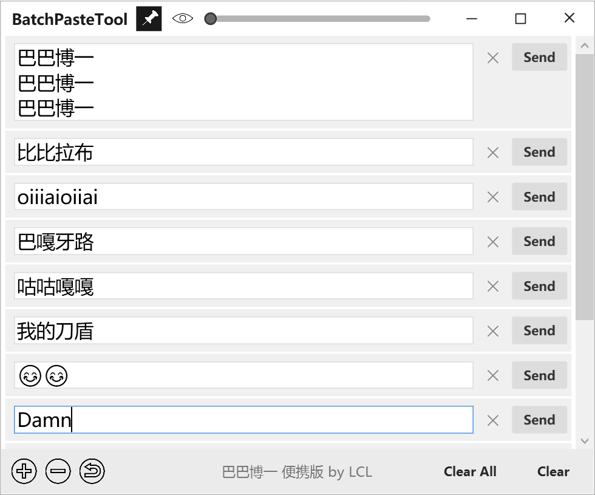
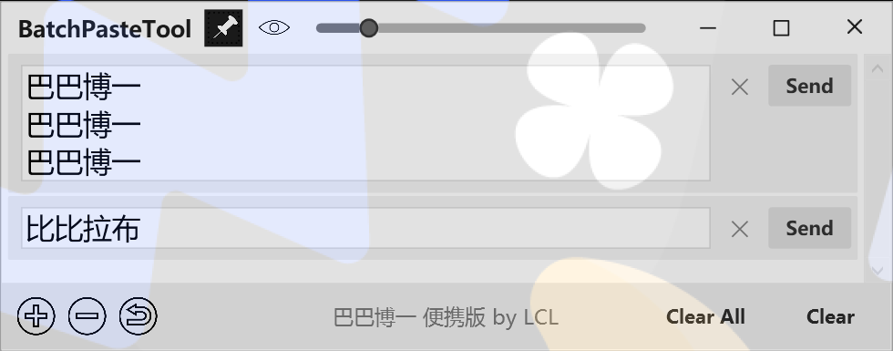

# BatchPasteTool

一款轻量级的 Windows 桌面批量文本粘贴工具。存储多条文本片段，一键粘贴到任意位置。

使用 **C# WPF (.NET 8.0)** 构建 — 无边框自定义窗口，灰白简约风界面设计。

> 📖 [English Version](README.md)

## 功能特性

- **批量粘贴**: 维护多条文本条目，每条都有独立的发送按钮。点击"Send"将文本复制到剪贴板并粘贴到光标位置（模拟 Ctrl+V）。
- **窗口置顶**: 将窗口固定在所有窗口之上，方便快速访问。
- **透明度控制**: 通过滑块调节窗口透明度，从完全不透明到 80% 透明。
- **撤销支持**: 可撤销任何操作 — 文本修改、条目增删、清空操作。也支持 Ctrl+Z 快捷键。
- **状态持久化**: 所有文本内容、窗口位置/大小、置顶状态、透明度自动保存，重启后恢复。
- **响应式布局**: 自由缩放窗口，透明度滑块随窗口宽度自适应拉伸。

## 系统要求

- Windows 10 或更高版本（64 位）
- [.NET 8.0 桌面运行时](https://dotnet.microsoft.com/en-us/download/dotnet/8.0)（框架依赖版本）
- 或无需任何运行时（便携版自带运行时）

## 安装

### 方式一：下载预构建版本

根据需求选择对应版本：

| 版本 | 文件 | 大小 | 说明 |
|------|------|------|------|
| **便携版** | [BatchPasteTool.exe](https://github.com/GR4Ai/BatchPasteTool/releases/latest/download/BatchPasteTool.exe) | ~155 MB | 单文件 EXE，无需安装，无需 .NET 运行时。直接运行即可。 |
| **安装包** | [BatchPasteTool-Setup.exe](https://github.com/GR4Ai/BatchPasteTool/releases/latest/download/BatchPasteTool-Setup.exe) | ~67 MB | 自解压安装程序。安装到 `%LocalAppData%\Programs\BatchPasteTool`，创建开始菜单和桌面快捷方式，含卸载程序。 |

> **说明：** 便携版内嵌完整 .NET 运行时（体积较大但零依赖）。安装包使用 ZIP 压缩以减小下载体积，同时保持自包含。

### 方式二：从源码构建

```bash
# 常规构建（需要 .NET 8 运行时）
cd src/BatchPasteTool
dotnet build -c Release
```

#### 便携版（自包含单文件）

```bash
dotnet publish -c Release -r win-x64 --self-contained -p:PublishSingleFile=true -p:IncludeNativeLibrariesForSelfExtract=true -o publish
```

生成 `publish/BatchPasteTool.exe`（约 162 MB）。

#### 安装包

```bash
# 1. 发布多文件版本
dotnet publish -c Release -r win-x64 --self-contained -o publish-installer

# 2. 构建 SFX 引导程序
dotnet publish -c Release -o installer/SfxStub/publish installer/SfxStub/SfxStub.csproj

# 3. 合并为安装包 EXE（需要 PowerShell）
powershell -File scripts/merge-installer.ps1
```

生成 `installer/BatchPasteTool-Setup.exe`（约 67 MB）。

## 项目结构

```
BatchPasteTool/
├── BatchPasteTool.sln
├── README.md
├── README_CN.md
├── src/
│   └── BatchPasteTool/
│       ├── BatchPasteTool.csproj
│       ├── App.xaml / App.xaml.cs
│       ├── Models/
│       │   ├── PasteItem.cs
│       │   ├── UndoEntry.cs / UndoType.cs
│       │   └── AppSettings.cs
│       ├── ViewModels/
│       │   ├── MainViewModel.cs
│       │   ├── PasteItemViewModel.cs
│       │   └── RelayCommand.cs
│       ├── Views/
│       │   ├── MainWindow.xaml / .cs
│       │   └── Converters/
│       ├── Services/
│       │   ├── ClipboardService.cs
│       │   ├── InputSimulationService.cs
│       │   ├── ConfigService.cs
│       │   ├── ForegroundWindowService.cs
│       │   └── UndoService.cs
│       ├── Helpers/
│       │   ├── NativeMethods.cs
│       │   └── Constants.cs
│       └── Resources/
│           ├── app_icon.ico / app_icon.png
│           ├── add.png
│           ├── delete.png
│           ├── pin.png / pin_filled.png
│           ├── transparency.png
│           └── undo.png
├── app.manifest
├── installer/
│   ├── install.ps1                   # 安装后脚本
│   └── SfxStub/                      # 自解压引导程序源码
├── reference-images/                 # UI 参考截图
├── legacy/                           # 原始 C++ 源码
└── README.md
```

## 使用指南

### 界面布局

<table>
  <tr>
    <td width="50%"></td>
    <td width="50%"></td>
  </tr>
</table>

### 控件说明

| 控件 | 说明 |
|------|------|
| **标题栏** | 拖动可移动窗口。 |
| **置顶按钮** (📌) | 切换窗口置顶模式。激活时图标实心。 |
| **透明度图标** (🔆) | 在不透明和半透明之间切换。 |
| **透明度滑块** | 拖动调节窗口不透明度。随窗口宽度自适应拉伸。 |
| **最小化 / 最大化 / 关闭** | 标准窗口控制按钮。悬停高亮。 |
| **文本框** | 输入或粘贴要发送的文本。字体：Segoe UI 18px。 |
| **✕ (清除)** | 清除当前条目的文本内容。 |
| **Send (发送)** | 复制文本到剪贴板并粘贴到光标位置。 |
| **+ (添加)** | 在末尾添加新条目。 |
| **− (删除)** | 删除最后一条（至少保留一条）。 |
| **↩ (撤销)** | 撤销上一步操作。也支持 Ctrl+Z。 |
| **Clear All** | 保留第一条但清空其文本，删除其余所有条目。 |
| **Clear Texts** | 清空所有条目的文本内容，不删除条目。 |

### 键盘快捷键

| 快捷键 | 操作 |
|--------|------|
| `Ctrl+Z` | 撤销上一步操作 |
| `Ctrl+N` | 添加新条目 |
| `Ctrl+Shift+S` | 依次发送所有条目 |

### 使用流程示例

1. 启动 **BatchPasteTool**。
2. 点击 **+** 添加需要的文本条目。
3. 在每个文本框中输入或粘贴文本片段。
4. 点击 **📌** 将窗口置顶保持可见。
5. 根据需要拖动**透明度滑块**调节窗口透明程度。
6. 点击任意条目的 **Send** 按钮将文本粘贴到目标应用。
7. 使用 **Ctrl+Z** 撤销误操作。

## 配置说明

程序状态保存到可执行文件同目录下的 `BatchPasteTool.json`。保存内容包括：
- 所有文本内容
- 窗口位置和大小
- 置顶状态
- 透明度级别

每 3 秒自动保存一次，退出时也会保存。

## 技术细节

- **语言**: C# 12
- **框架**: WPF (.NET 8.0)
- **架构**: MVVM（手写实现，无第三方框架）
- **窗口**: 无边框自定义窗口，`AllowsTransparency=True`，自定义 `WM_NCHITTEST` 实现 8 方向缩放
- **输入模拟**: Win32 `SendInput` API（Ctrl+V）
- **序列化**: System.Text.Json
- **无第三方 NuGet 依赖**

## 许可证

本项目按现状提供，供个人和专业用途使用。
